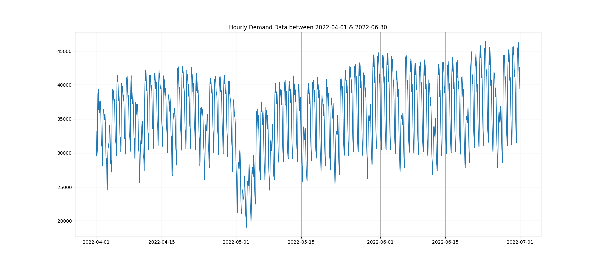
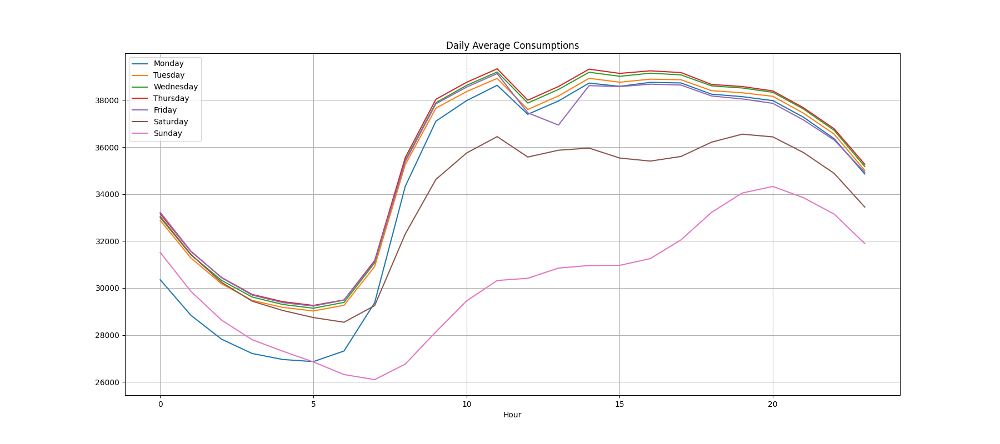
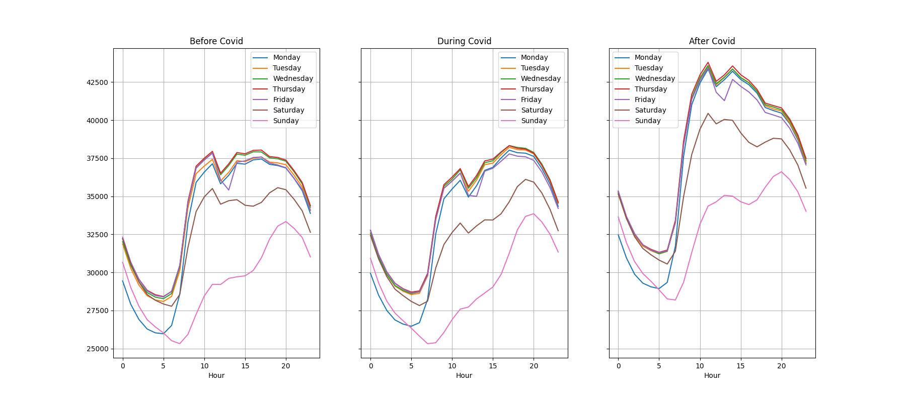
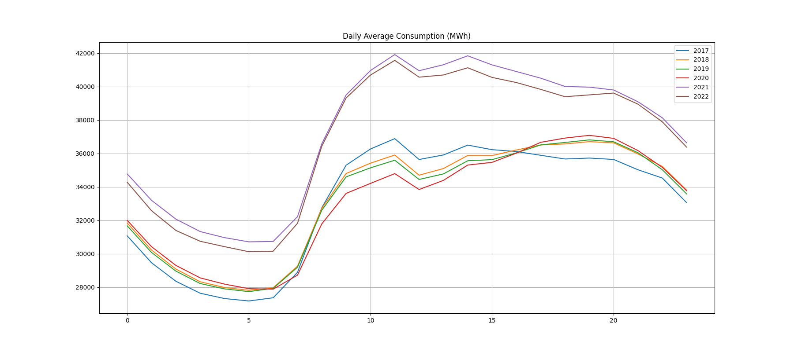
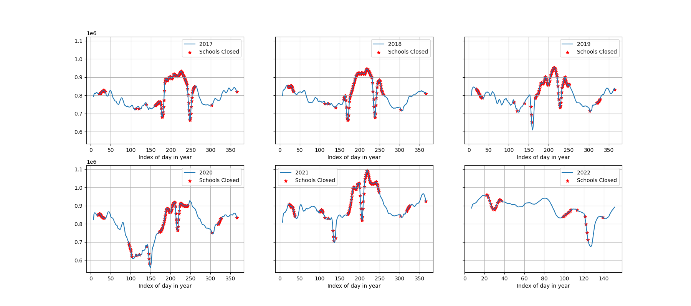
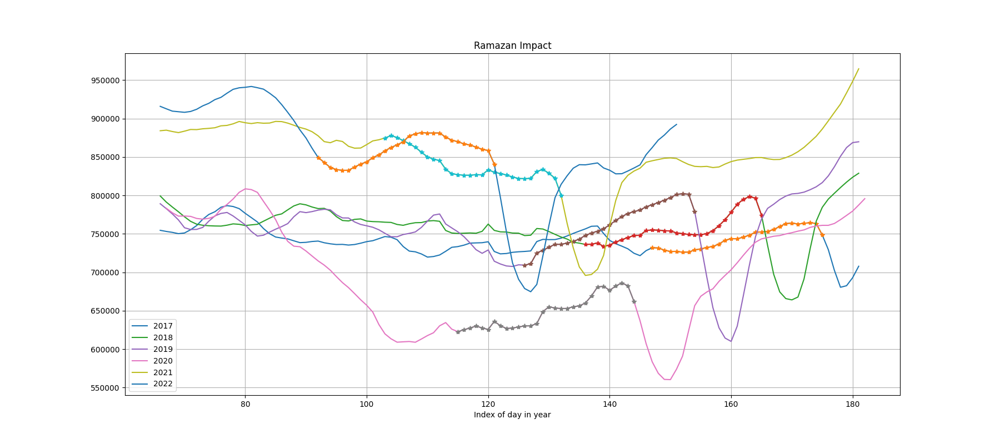

# Electricity Demand Forecasting

## Table of Contents
* [Introduction](#introduction)
* [Data Analysis](#data-analysis)
  - [Examination of Covid-19 Impact](#examination-of-covid-19-impact)
  - [Examination of Schools' Impact](#examination-of-schools-impact)
  - [Examination of Ramazan Impact](#examination-of-ramazan-impact)
  - [Extracted Features and Data Pre-Processing](#extracted-features-and-data-pre-processing)
* [Forecasting Algorithms](#forecasting-algorithms)
* [Experimental Results](#experimental-results)

## Introduction
In the rapidly developing world, energy needs are increasing at the same pace. Since the industrial revolution, countries with access to energy resources have come to economically strong positions. On the other hand, the ever-increasing macro-economic and micro-economic competition between different entities is forcing the absolute need for efficient energy use in order to achieve economic efficacy and/or efficiency.

On the other hand, the global sustainable growth need has brought new opportunities and challenges hand-in-hand. Regulatory bodies have been forcing economic entities to use green energy sources more than non-green ones. Additionally, economic entities are encouraged to use green energy sources more efficiently.
Electricity, being relatively easy to transmit, has had ever-increasing use globally. Switching the electricity production mainly from non-green to green processes increases its potential for sustainability-oriented development. On the other hand, the relative inefficiency and higher cost of storing electrical energy make the instant balancing of demand and supply extremely important. 

For some product or service categories, deciding whether supply follows demand or demand follows supply can be regarded as a chicken-egg problem of economics. However, supply follows demand due to the need for instant balancing in the electricity market. Hence, for both producers and regulators, it is of utmost importance to have an excellent understanding of demand. An accurate demand forecast satisfies this need.

Electricity demand forecasting can be beneficial in different time horizons. For example, for an economic entity considering its existence in the long-term, a demand forecast with monthly or yearly resolution would be the most appropriate. In addition, for a producer trying to make operational adjustments in the near future, forecasting the daily demand for the upcoming week or fortnight would be beneficial.

On the other hand, an electricity producer who has to give hourly offers on the supply side in the Day-Ahead Market is primarily interested in the hourly forecasts for the next 24 hours. Similar models (if not the same) can be utilized for applications in these different time horizons with training with appropriate data.

Spot markets are divided into two; Day-Ahead Market (DAM) and Intra-Day Market (IDM). The DAM is the market where the electricity price for each hour of the next day is determined by auction and has a larger transaction volume. On the other hand, IDM enables the participants to change their position in the Day-Ahead Market for a certain amount of time before electricity is physically transmitted. Any imbalance in the electricity grid caused by a mismatch of demand and supply is compensated after the closure of the IDM. Hence, having precise demand forecasts will provide high value to all parties in the electricity market.

This project proposes an algorithm and implementation for forecasting hourly demand in the next 24-hour time frame. The forecasting system can be utilized by market players on the supply side and the regulatory bodies most interested in balancing the supply and demand. The system is trained and tested on Turkish electricity market data and hence, very few features are special to Turkey. Nevertheless the system can be utilized in any electricity market with minimal modifications (and re-training).

## Data Analysis

Data used in this project is obtained from the official website of Energy Exchange Istanbul (EXIST) or Enerji Piyasaları İşletme A.Ş. (EPİAŞ) by its Turkish name ([EXIST / EPIAS. (2022)](#epias-2022)). Therefore, the two acronyms EXIST and EPİAŞ will be used interchangeably.

Hourly electricity demand data between 2017-01-01 and 2022-06-30 are utilized in this study. For a visual introduction, the following figure presents the hourly electricity consumption in Turkey between 2022-04-01 and 2022-06-30.

As seen in the above figure, the electricity consumption shows regular patterns, higher during business days than weekend days. The sharp drop at the beginning of May reflects the lower electricity usage during the Ramazan Feast.

The daily pattern in demand (in MWh) can be seen in the following figure.

As expected, the business days have higher average consumption than weekend days. In addition, Saturdays, which are a working day in some companies, have higher average consumption than Sundays. On the other hand, the intra-day consumption stays at the highest level between 10 am and 8 pm.

### Examination of Covid-19 Impact

One recent question that deserves attention is whether the Covid-19 Pandemic impacts electricity consumption. For this purpose, the years 2017, 2018, and 2019 are labeled “Before Covid”, whereas 2020 is marked as “During Covid”. On the other hand, the years 2021 and 2022 are examined as “After Covid.” The following figure shows the daily averages (MWh) corresponding to those groups.

Careful examination of the above figure reveals that the general pattern between business days and weekend days is preserved before, during, and after Covid. In addition, the consumption stays close to its peak level between 10 am and 8 pm in all of the sub-figures. However, there is a definite increase in the general level of electricity consumption after Covid, when compared with consumption before Covid and during Covid. 

Is this an impact of the Covid Pandemic, or is there already an increasing trend throughout the years? The following figure shows the average daily consumption for all years separately.

A careful examination of the above figure reveals that there is not a clear increasing trend in consumption throughout 2017, 2018, and 2019. On the other hand, electricity consumption in 2021 is slightly higher than in 2022. Therefore, although the consumption after Covid (2021 & 2022) is higher than the consumption in previous years, any apparent reason could not be found in this analysis.

### Examination of Schools' Impact

One other interesting question to examine is whether schools have a significant impact on electricity consumption. For this purpose, the following figure shows the 7-day rolling average of daily electricity consumption for different years.

Having a careful look at the above figure reveals an interesting relationship between school closure dates and electricity consumption. It is evident that electricity consumption generally is higher when the schools are closed. This can easily be explained by the fact that most of the school closures happen in summer when electricity consumption increases due to cooling needs. Although there is only a correlation but no causation relationship between schools and electricity consumption, this is most of the time more than enough for a machine learning algorithm which is the backbone of forecasting.

### Examination of Ramazan Impact

Another interesting question to analyze is whether Ramazan has a significant impact on electricity consumption. For this analysis, the following figure presents the 7-day average of daily electricity consumption separately for each year. Days falling in Ramazan are indicated with a marker (*).

This is not an easy question to answer with only 6 years of data because Ramazan is sliding backward by 10-11 days every year. According to the above figure, electricity consumption increases throughout Ramazan and makes a peak just before Ramazan Feast in 2017, 2018, 2019, and 2020. On the other hand, this behavior is not observed during Ramazan in 2021 and 2022. It is not very easy to separate whether this behavior depends on Ramazan's sliding characteristic or is just a coincidence. More data should be examined to find a statistically significant answer.

### Extracted Features and Data Pre-Processing

TODO

## Forecasting Algorithms

TODO TODO TODO

## Experimental Results

TODO TODO TODO

## References

 
EXIST / EPIAS. (2022), 
_EXIST Transparency Platform,_
https://seffaflik.epias.com.tr/transparency/

 
Erişen, E. (2013), 
_On the Parametric and Non-Parametric Prediction Methods for Electricity Load Forecasting,_ 
M.Sc. Thesis, Middle East Technical University
